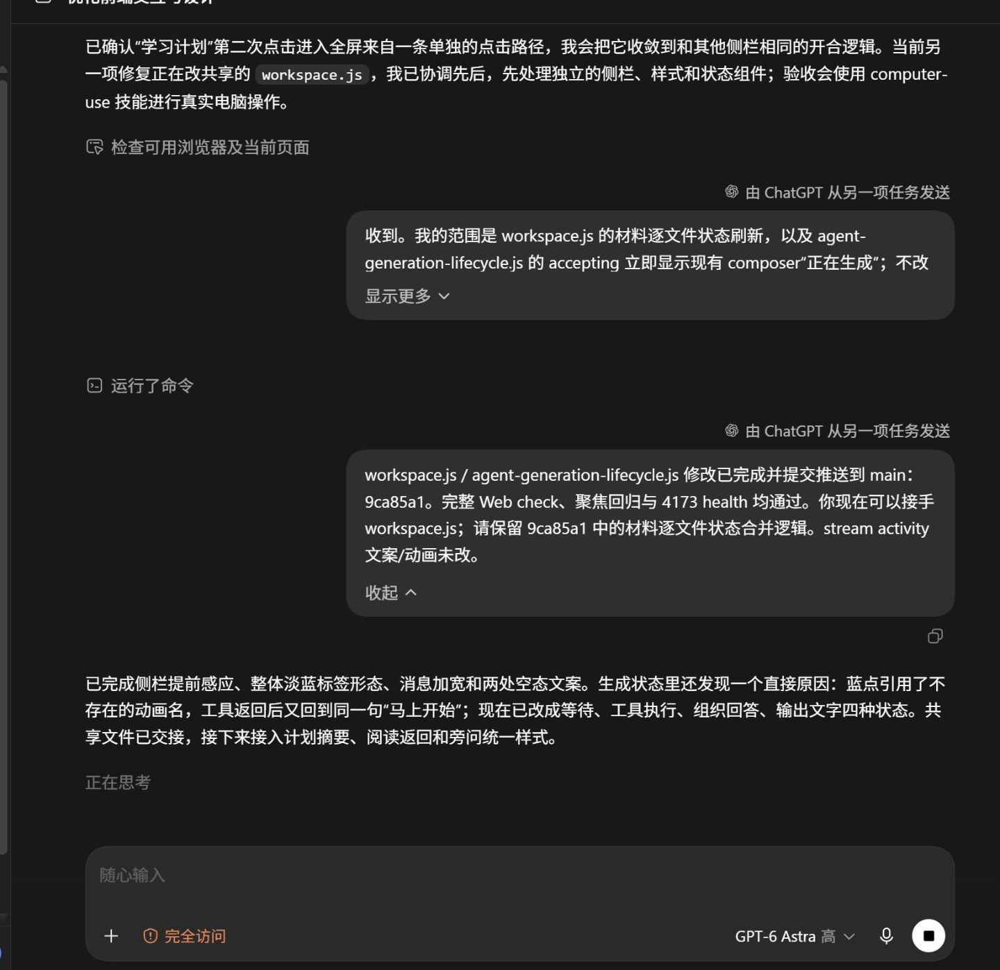
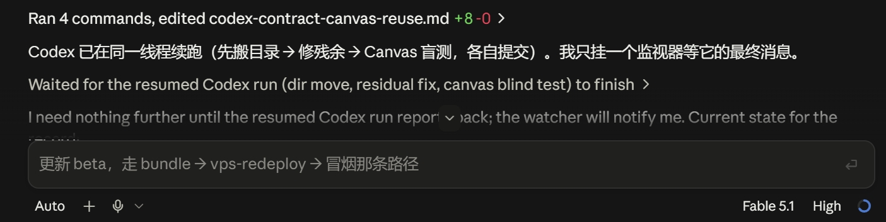
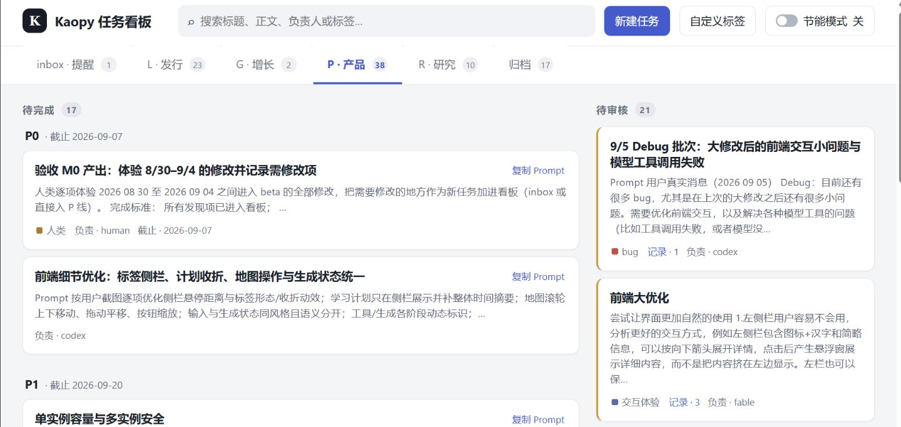
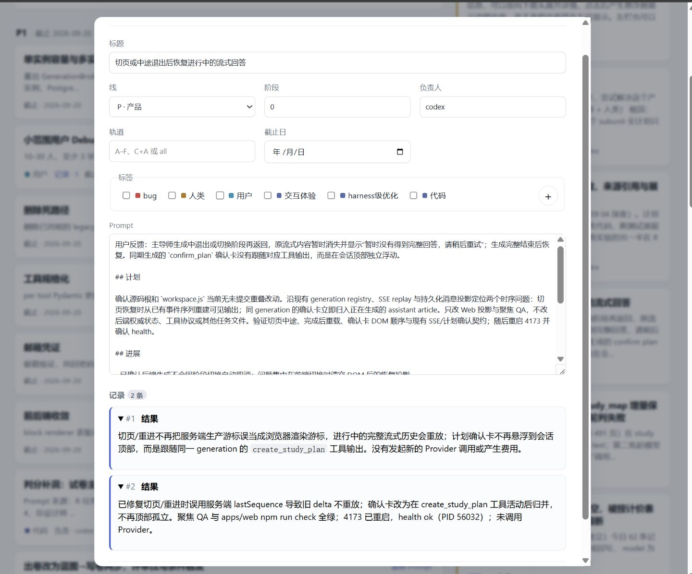

# Light Dashboard

**An ultra-lightweight multi-agent delivery workstation**

[简体中文](README.md) · [English](README.en.md)

## Author's note

I have been building a large software project that spans code development, launch and communications, automated research, and several other kinds of work.

To run it, I assembled a nearly dependency-free, no-database protocol on my local computer that uses Markdown as the single source of truth. Five GPT-6 threads and Fable share information, coordinate on their own, and deliver work in order through a local web view, while a human supervises the whole process as it unfolds.

Only a few months earlier, the same method with a GPT-5.5 cluster still needed a central "chief architect", or control tower, to coordinate handoffs. Now five primary threads and many sub-agents cooperate efficiently in a decentralized way, with very little friction.

My reaction when it started running on its own: **nuclear-grade slouch.**



*Figure 1: Codex waits, communicates, and picks up another thread's delivery.*



*Figure 2: Fable waits for Codex instead of polling or duplicating the work.*



*Figure 3: An early project-specific dashboard. The public template no longer has fixed lanes.*



*Figure 4: Prompt, plan, progress, and delivery history become the human supervision interface.*

---

Light Dashboard is not a project-management platform. It is a small multi-agent coordination protocol: every task is a Markdown file, agents read and write those files directly, and humans observe through a local web projection. There are no accounts, databases, message buses, or fixed organizational structures, and no hidden task state.

More precisely, it is **a coordination pattern with a runnable reference implementation**. It does not try to replace GitHub Issues, Linear, or Jira. It addresses a narrower question: when several agents can operate on the same repository, how do they share work facts, avoid overlap, and keep their progress visible to humans without an always-on central orchestrator?

## First principles

### 1. Shared facts must be visible

Chat context belongs to one thread and cannot serve as team state. The Task MD is the shared delivery record that every agent and human reads and that Git can track.

### 2. Coordination comes from ownership, not constant routing

One task, one file; one owner per file at a time. Agents run in parallel when their tasks do not overlap. When ownership overlaps, they serialize or hand off explicitly. No control tower has to relay each message.

### 3. Progress is content, not another state machine

The executor writes `## Plan`, `## Progress`, and verification evidence into the task file. Humans see the actual work record instead of a potentially stale `doing` indicator.

### 4. Delivery and acceptance are separate

There are only three states: `todo → review → done`. An agent submits finished work for review, and a human archives it after acceptance. Whether code is merged is defined separately by the host project.

### 5. The web page is only a projection

The page rereads the Markdown every two seconds. It searches, groups, displays, and copies execution prompts. Close the page and the protocol still works; delete the page and the complete task record remains.

## Minimal architecture

```text
Agent / Human
      │ reads and writes directly
      ▼
docs/tasks/active/*.md ──approve──▶ docs/tasks/archive/*.md
      │
      └── local read-only HTTP projection ──▶ streaming human supervision
```

A task has four required fields: `id`, `title`, `status`, and `created`. `owner`, `stream`, and `due` are optional hints, not an authorization system.

`stream` is arbitrary text. Agents may create `frontend`, `research/model-memory`, or `launch-week` as the work requires, use any number of streams, or use none at all. The repository does not encode fixed lanes.

### Example streams

```yaml
# Task A
stream: product/frontend

# Task B
stream: research/agent-memory
```

These values create no directories, permissions, or workflows. They only group related tasks in the web view. Another project can use `client/acme`, `paper/experiments`, or no stream at all.

## Why this works now

Markdown did not become more capable; agents did. In my own workflow, GPT-5.5 clusters still needed a control tower to restate context and arrange handoffs. With GPT-6 and Fable, once shared facts and file ownership are explicit enough, agents can execute for long stretches, wait for other threads, read their deliveries, and continue on their own.

"Decentralized" here does not mean leaderless consensus in the distributed-systems sense. It means that **no human or model has to keep relaying every message**. Git, the filesystem, and final human acceptance remain explicit coordination boundaries.

## Three-minute start

Requires Node.js 20+ and no package installation.

```powershell
npm run board
```

Open `http://127.0.0.1:4790`. In another terminal, create a task:

```powershell
node tools/board/task.mjs add --title "Deliver one verifiable result" --owner gpt-6 --stream product/frontend
```

After the agent finishes and verifies the work:

```powershell
node tools/board/task.mjs done <id> --feedback "Result and verification evidence"
node tools/board/task.mjs show <id>
npm run board:check
```

After human acceptance:

```powershell
node tools/board/task.mjs approve <id>
```

See [`AGENTS.en.md`](AGENTS.en.md) for the complete operating contract, [`CLAUDE.en.md`](CLAUDE.en.md) for the compact Fable/Claude entry prompt, and [`docs/tasks/README.en.md`](docs/tasks/README.en.md) for the file protocol. The Chinese originals are [`AGENTS.md`](AGENTS.md) and [`CLAUDE.md`](CLAUDE.md).

## Where it fits

Good fit: a small team that shares one local repository or synchronizes through Git, can split tasks along explicit file boundaries, wants streaming human supervision, and does not want to deploy a coordination backend.

Poor fit: cross-organization authorization, strong real-time consistency, regulated audit controls, complex dependency scheduling, or hundreds of concurrent operators. The local `.board.lock` only serializes short writes on one filesystem; it is not a distributed lock.

## Repository map

```text
AGENTS.md / AGENTS.en.md       complete agent operating contract
CLAUDE.md / CLAUDE.en.md       compact Fable / Claude entry prompt
docs/tasks/active/             active tasks
docs/tasks/archive/            accepted tasks
tools/board/task.mjs           minimal CLI
tools/board/server.mjs         read-only local web server
tools/board/index.html         single-file interface
```
